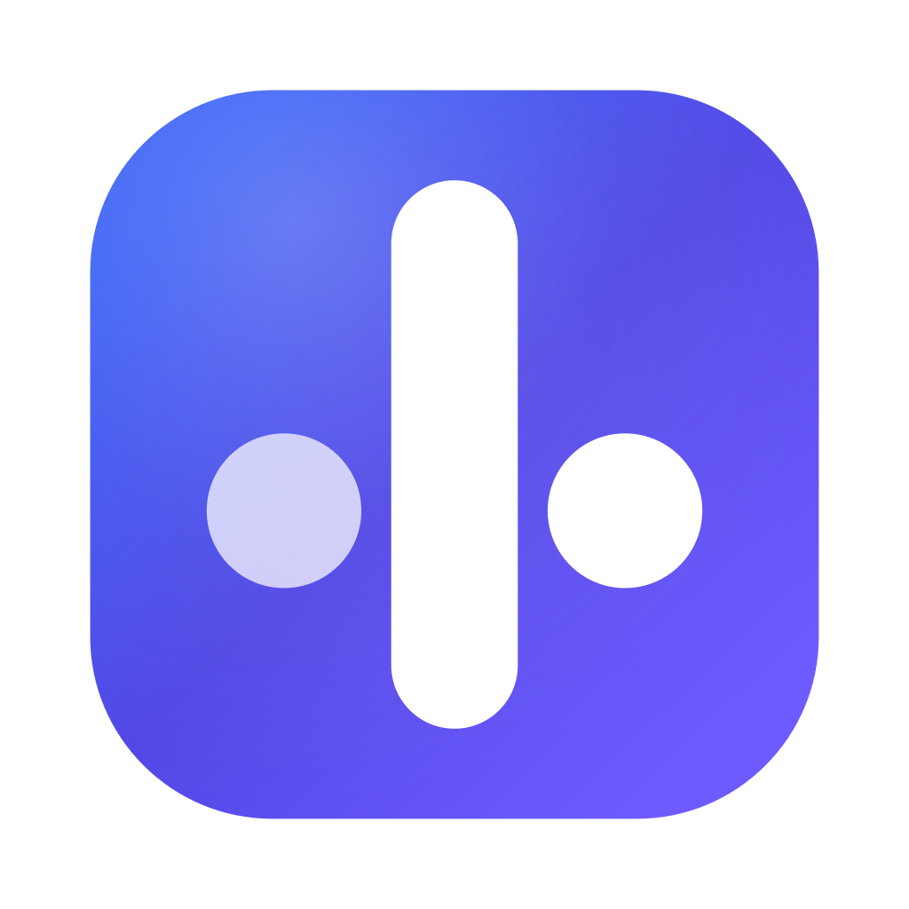

<p align="center">
  
</p>

<h1 align="center">小步</h1>

<p align="center">
  听、说、读、写全方位英语学习工具
</p>

<p align="center">
  <a href="https://echo-type.app">在线体验</a> ·
  <a href="https://github.com/Talljack/echo-type/releases">下载桌面端</a> ·
  <a href="https://github.com/Talljack/echo-type/issues">反馈建议</a>
</p>

<p align="center">
  <a href="https://github.com/Talljack/echo-type/releases"></a>
  <a href="https://github.com/Talljack/echo-type/blob/main/LICENSE"></a>
  <a href="https://github.com/Talljack/echo-type/stargazers"></a>
</p>

<p align="center">
  <a href="./README.md">English</a>
</p>

---

## 为什么选择小步？

大多数英语学习工具只专注于单一技能。小步将**听、说、读、写**融合在一个工作流中 —— 用同一份内容练习四项技能，这才是语言学习的正确方式。

- 导入任何文章、YouTube 视频或网页作为学习素材
- 同一份内容可以听、跟读、打字练习，多维度吸收
- 影子跟读：将 Listen → Read → Write 串联起来深度练习
- 英语水平测试（CEFR A1–C2），根据你的水平推荐匹配难度
- AI 导师支持 15+ 服务商，随时提问、练习、纠错
- 发音评估支持音素级 IPA 反馈
- FSRS 间隔重复，科学安排复习时间
- 浏览器直接使用，或下载 macOS / Windows / Linux 桌面端
- 数据本地存储，不联网也能用，隐私无忧

## 功能一览

| 模块 | 你做什么 | 你得到什么 |
| --- | --- | --- |
| **听力 (Listen)** | TTS 朗读内容（浏览器语音 / Fish Audio / Kokoro），逐词高亮跟随 | 听力理解、语音输入 |
| **口语 (Speak)** | 在 50+ 真实场景中对话练习（点餐、面试、看医生……） | 实时语音识别、发音评分 |
| **阅读 (Read)** | 阅读文章，内置中文翻译 | 阅读理解、语境词汇积累 |
| **写作 (Write)** | 对照原文打字输入 | 打字速度 (WPM)、准确率追踪、错误分析 |
| **影子跟读** | 同一内容横跨 Listen → Read → Write 练习 | 多技能深度强化 |
| **水平测试** | 30 道自适应 CEFR 测试题 | 了解你的等级（A1–C2），内容自动匹配难度 |
| **AI 导师** | 随时和 AI 英语教练对话 | 语法讲解、词汇测验、练习指导、答疑解惑 |
| **内容库 (Library)** | 从 URL、YouTube、文件、音频导入，或手动输入 | 统一内容库，所有模块共享 |

内容库支持多种素材类型：

- **单词** —— 单个词汇，含释义、例句和发音
- **句子** —— 短语和表达，用于句型练习
- **文章** —— 各难度等级的完整阅读材料
- **场景对话** —— 50+ 真实生活场景（点餐、看医生、求职面试、机场、酒店入住……）
- **单词本** —— 精选主题词汇包（大学入学、职场商务、日常生活、旅行出行、科技、语法、习语……）

所有内容支持标签分类、搜索，并可在任意模块中练习。AI 还能根据你的 CEFR 等级按需生成新内容。

| **仪表盘 (Dashboard)** | 查看每日计划、学习数据、最近练习、连续天数 | 一目了然掌握学习进度 |
| **间隔重复** | 基于 FSRS 的智能复习提醒 | 在科学最佳时间复习单词和短语 |
| **云同步** | 用手机号验证码登录 | 跨设备同步进度、内容库和设置 |
| **快捷键** | 完全可自定义的键盘绑定，命令面板 (Cmd+K) | 全键盘操作，效率拉满 |

## 快速开始

### 1. 打开小步

浏览器访问 [echo-type.app](https://echo-type.app)，或[下载桌面端应用](https://github.com/Talljack/echo-type/releases)。

### 2. 测试你的英语水平

进入 **设置 > English Level**，做一组 30 道题的快速测试。小步会判断你的 CEFR 等级（A1–C2），并自动调整内容推荐难度。

### 3. 配置 AI（可选但推荐）

进入 **设置 > AI Provider**，添加你的 API Key。支持 OpenAI、Anthropic、Google、DeepSeek、Groq、xAI、Mistral 等 15+ 服务商。配置后可使用 AI 导师、内容生成、翻译和发音评估功能。

### 4. 导入你的第一份内容

进入 **Library（内容库）**，导入学习素材：

- **粘贴 URL** —— 任何文章或博客，自动提取正文
- **YouTube 链接** —— 自动提取字幕文本
- **上传文件** —— 文本、PDF 或音频（AI 自动转写）
- **手动输入** —— 单词、句子或完整文章
- **浏览单词本** —— 内置主题词汇包

### 5. 开始练习

在任意模块打开导入的内容：

- **Listen** —— 听朗读，逐词高亮跟随
- **Read** —— 阅读，中英文对照翻译
- **Write** —— 打字练习，追踪速度和准确率
- **Speak** —— 角色对话，语音识别实时反馈

### 6. 试试影子跟读

在设置中开启**影子跟读 (Shadow Reading)**，将内容串联到多个模块。在 Listen 中练习的文章，会自动出现在 Read 和 Write 中 —— 通过多种技能强化同一份素材。

### 7. 复习提升

- 查看**仪表盘**了解每日计划、学习进度和连续天数
- **间隔重复**会在最佳时间提醒你复习
- **AI 导师**随时可用，点击右下角即可对话

## 使用场景

**备考雅思/托福？** 先做水平测试，然后导入阅读素材，用影子跟读同时练习听说读写四项技能。

**想提升发音？** 在 Speak 模块中练习 50+ 真实场景对话，开启 SpeechSuper 获取音素级 IPA 反馈。

**每天读英语新闻？** 粘贴文章 URL，小步自动将它变成听力 + 阅读 + 打字的全方位练习。

**积累词汇？** 浏览内置单词本（大学、职场、旅行、日常），用 FSRS 间隔重复复习，AI 自动生成测验。

**不知道从哪开始？** 做个水平测试 —— 小步会推荐匹配你 CEFR 等级的内容。

**想自由安排学习节奏？** 所有数据本地存储，无需注册、无需订阅、没有广告。想同步才登录。

## 桌面端

| 平台 | 下载 |
| --- | --- |
| macOS (Apple Silicon) | `小步_<ver>_aarch64.dmg` |
| Windows | `小步_<ver>_x64-setup.exe` |
| Linux (Debian/Ubuntu) | `小步_<ver>_amd64.deb` |

桌面端支持**系统托盘**（显示/隐藏、快捷导航、退出）、**键盘快捷键**和**自动更新**。

## 开发者

```bash
git clone https://github.com/Talljack/echo-type.git
cd echo-type
pnpm install
cp .env.example .env.local
pnpm dev
```

打开 [http://localhost:3000](http://localhost:3000)。桌面端开发需安装 [Rust](https://rustup.rs/)，然后运行 `pnpm tauri:dev`。

**技术栈：** Next.js 16 · React 19 · TypeScript · Tailwind CSS v4 · Tauri v2 · Vercel AI SDK · IndexedDB · Supabase

## 许可证

[MIT](LICENSE)
